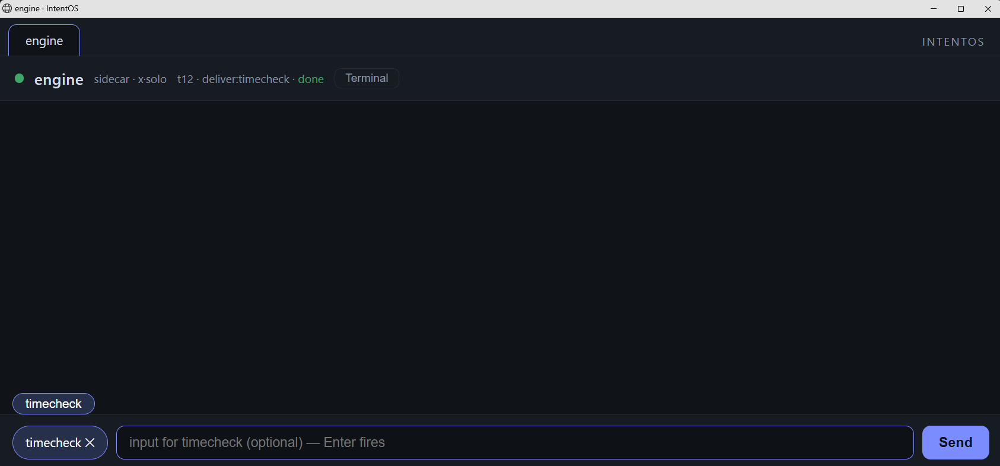
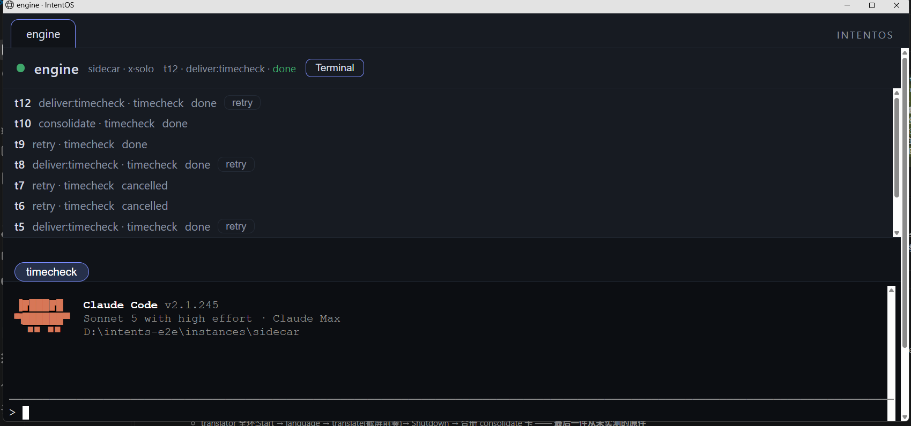
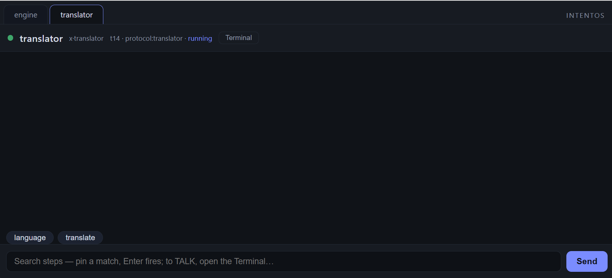
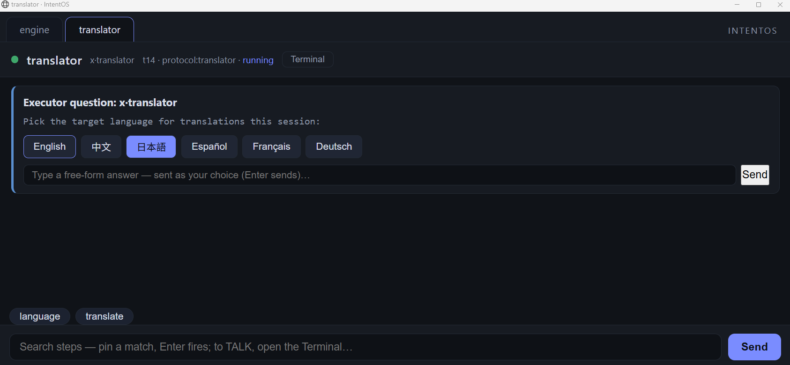
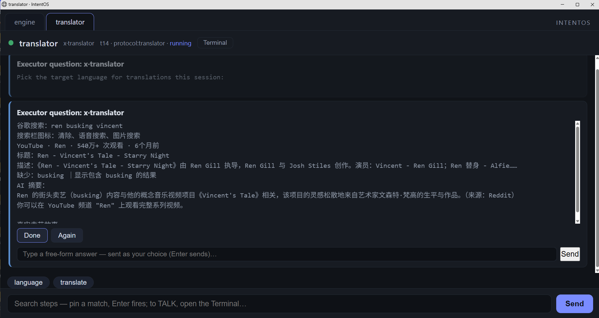
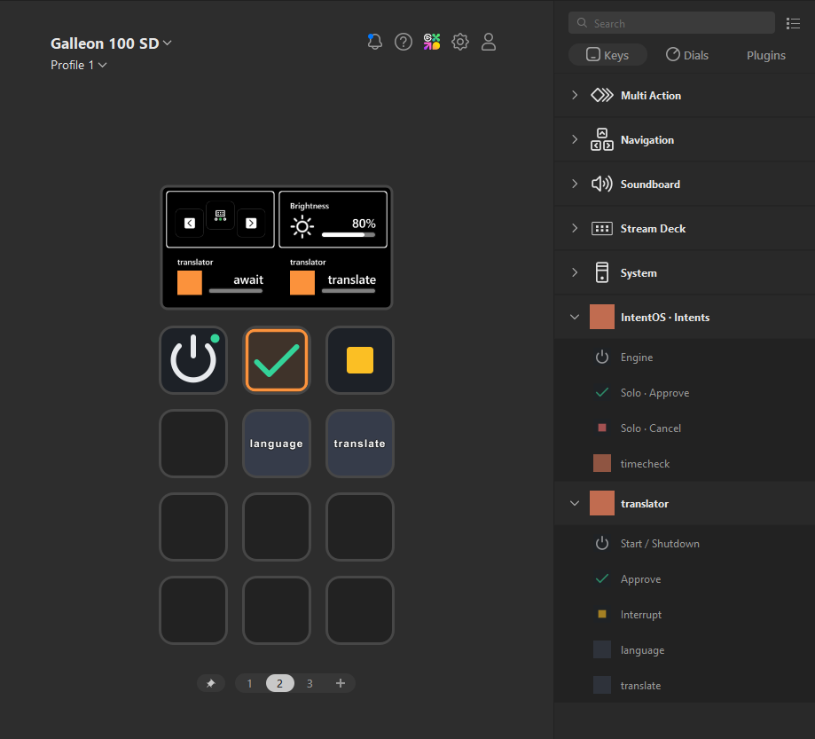
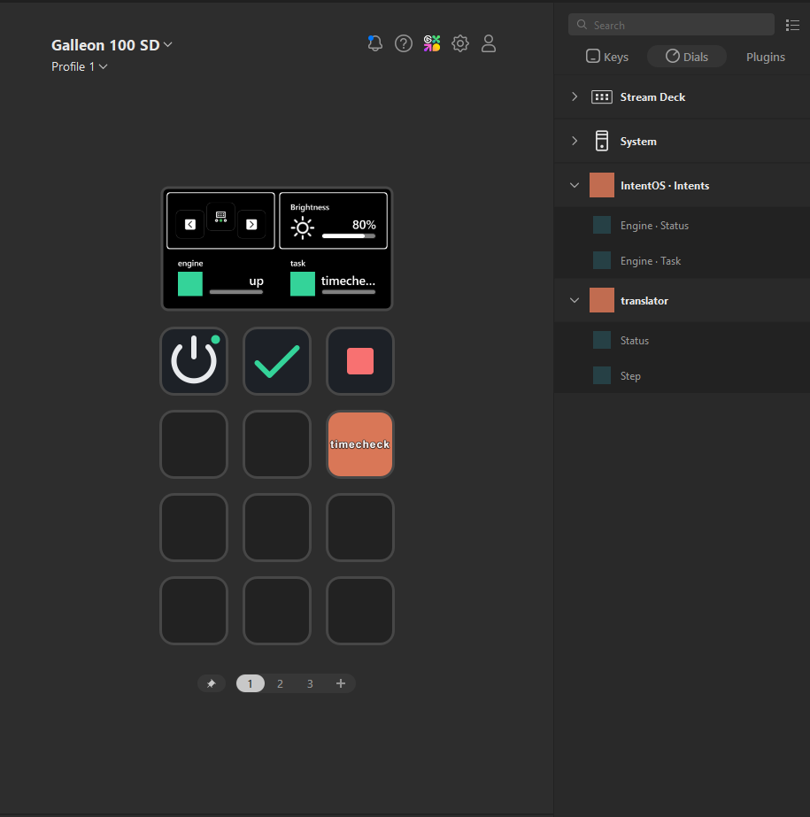
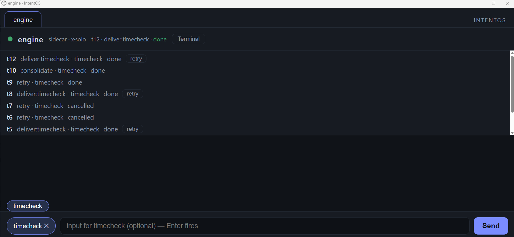

# User guide

How to actually use Intents for Claude Code, day to day: create
intents by talking to the sidecar, fire them from keys or the panel,
and know where your stuff lives when you want to look at it. This
document is for humans; the technical catalog (for agents and
contributors) is `FEATURES.md`, and the field-level contract is
`INTENT_SPEC.md`.

Setup itself is in [SETUP.md](SETUP.md). This guide assumes
the engine is running and the hub window is open.

## The 30-second mental model

You press a key (Stream Deck, or a click in the hub). The **engine**
turns that press into an order and delivers it to an agent **seat** —
a real Claude Code CLI session the engine opened for you. The seat
does the work and talks back through **cards** in the hub: questions,
results, approvals. You never type prompts to make things run; you
made the asset once, and from then on it's a button.

Three seats to know:

- **sidecar** — the maintenance seat. This is the one you *talk* to:
  creating, revising, repairing intents all happen here.
- **x·solo** — the executor. Standalone intents run here, headless,
  one process per order. You never talk to it; you see its receipts.
- **x·\<booklet\>** — one resident seat per booklet (protocol). Opens
  when you start the booklet, remembers things across steps, closes
  when you shut it down.

## The hub window

Opens automatically at boot (manual address:
`http://127.0.0.1:9700/hub`). One tab per seat. Each tab has three
surfaces:

- **Card stream** — the main feed: results, questions with option
  buttons, approval requests, receipts. When the system wants your
  decision, it's always a card here (key-face lights on the deck are
  advisory only — the cards are the truth).
- **Input line** — a search box. On the engine tab, typing filters
  your intents; click a match to **pin** it, and Enter fires. With an
  intent pinned the same box takes optional input text for that run.
  Inside a booklet tab it searches that booklet's steps instead. This
  is the complete no-hardware trigger path: everything a deck key can
  do, the input line can do.
- **Terminal drawer** — the seat's raw CLI, for the rare moments a
  seat asks something only answerable in the terminal (first-run trust
  wizard, login) — and for watching an agent think, if you like that.





## Creating an intent (talk to the sidecar)

Open the hub's **sidecar tab** and tell it, in plain language, one
thing you want push-button. Example: "when I press a key, fetch
today's weather for Seattle and tell me in one line."

What happens next:

1. The sidecar opens a ticket — the engine creates a **folder** for
   the intent under the sidecar's home, with a `schema.md` field
   textbook inside.
2. The sidecar writes the declaration (`intent.json`) — the steps in
   the E pseudo-code grammar, the acceptance criteria — plus any
   helper scripts under `tools/`.
3. It registers the folder. **Registration = compilation**: the
   engine validates every field against the schema, and raises an
   **approval card** to you.
4. You read the card (it names what was staged) and press
   **Approve**. The intent is live; its key face exists from now on.

That last click is yours by design — the engine never presses an
approval for you. If the sidecar got something wrong, say so in its
tab instead of approving; editing the folder and re-registering is
the normal loop, not an exception.

The two seeded examples (`intentos seed` — **timecheck** and
**translator**) exist precisely so you can open their folders and see
what a finished registration looks like before you make your own.
(Seed before starting the engine; seeded while it was running, they
show up after one engine restart — see [SETUP.md](SETUP.md).)

<!-- screenshot: registration approval card (docs/img/approve-card.png) -->

## Creating a booklet (protocol)

Same conversation, bigger shape. A booklet is for interactions where
**the next step needs to remember the last one** — a translation
session with a chosen target language, a practice session with a
running score. Tell the sidecar what the session is and what the
per-press steps are; it will lay out one folder containing:

- `protocol.json` — the booklet declaration (member roster),
- `skill.md` — the booklet's manual, which you approve in full,
- `members/<step>/intent.json` — one declaration per step, same
  field table as a standalone intent.

The whole booklet registers through one gate: one bad member rejects
the whole thing (with each problem named), so what goes live is
always a complete, coherent set. After approval the booklet gets its
own key group: a **Start** key, one key per member step, and
**Shutdown**.

## Triggering

**Standalone intent**: press its key (or click it on the intents
panel). The engine runs any declared prelude first (e.g.
`screenshot`, taken from the monitor under your mouse), then
delivers the order to x·solo. The
result comes back as a card with a receipt (duration, calls, tokens).

**Booklet**: press **Start** to open the bracket — the booklet's
seat wakes up and greets you. Press member keys in any order, as many
times as you want; each press is one step, and anything the step
needs from you arrives as a card. Press **Shutdown** to close: the
seat runs its wrap-up, the engine settles the books, and you get a
closing receipt.



When a step needs your input, the card gives you both option buttons
and a free-form box — click or type, whichever is faster:



And a step's result comes back the same way — as a card, with the
step's own follow-up buttons when it has a next move:



## Stream Deck

The engine compiles one plugin per booklet (plus a system plugin
carrying the engine keys and your standalone intents) straight into
`%APPDATA%\Elgato\StreamDeck\Plugins\`. Binding is a drag, not a
setup:

1. Approve your intents and booklets — the plugins compile at
   registration, automatically.
2. Restart the Stream Deck app once so it picks up the new roster
   (it reads plugins only at launch).
3. Find the groups in the app's sidebar: **IntentOS · Intents**
   (engine keys + every standalone intent) and one group per
   booklet. Key actions live under the **Keys** tab; the status bars
   live under **Dials**.
4. Drag what you want onto your deck. There is nothing to configure
   per key — each action already carries its route, re-read on every
   press (even a changed engine port needs no re-drag). Only a
   roster change — new booklet, retirement, rename — needs the one
   app restart from step 2.



### Reading a key face

One rule: **graphics = system key, text = your asset.** Color on a
key face never decorates — it is reserved for status.

| Face | Key | Press |
|---|---|---|
| power glyph, status dot | **Engine** (system group) | tap = start — and it revives a dead engine, the launch command is baked into the key; hold = shut the engine down |
| power glyph | **Start / Shutdown** (booklet group) | one toggle: a closed booklet opens, an open one wraps up; pressing again mid-wrap forces the close |
| green check | **Approve** | presses Approve on the newest card waiting for you (system group: executor cards; booklet group: that booklet's cards) |
| yellow square | **Interrupt** | cuts the seat's current turn; the order itself survives |
| red square | **Solo · Cancel** | force-stops the whole order (same shape as interrupt — the color says how hard) |
| orange, named | a standalone intent | one press = one run |
| slate, named | a booklet member step | one press = one step |

The **dials** are read-only status bars for the touch strip:
**Engine · Status** (up/down), **Engine · Task** (the newest
in-flight order, `+N` when several run in parallel), and per booklet
**Status** and **Step** (the current step's name). Bar colors follow
one palette on every surface: green = done, blue = running, orange =
a card is waiting on you, yellow = queued, red = failed, grey =
idle. The lights are advisory only — when a decision is needed, the
truth is always a card in the hub.



No deck? Skip this section entirely — the hub's input line and
panels are a complete trigger surface.

## Where everything lives

One workspace directory holds everything, with a single exception:
compiled Stream Deck plugins go where the Stream Deck app requires
them (`%APPDATA%\Elgato\StreamDeck\Plugins\`, namespaced per
workspace; [SETUP.md](SETUP.md#uninstall)'s uninstall section covers
removing them).
Everything else stays in the
workspace. The map:

```
<workspace>/
├─ config.json          # your knobs (models, PERM_ALLOW, …) — yours to edit
├─ state.db             # the compiled ledger (what's registered/live) — engine's
├─ instances/
│  ├─ sidecar/          # the sidecar's home
│  │  └─ <intent>/           # ← your intents' SOURCE folders live here
│  │     ├─ intent.json      #   the declaration (edit = revise)
│  │     ├─ schema.md        #   field textbook (engine-refreshed)
│  │     ├─ CLAUDE.md        #   the folder's conventions (yours; never overwritten)
│  │     ├─ tools/  inputs/  #   helper scripts · materials
│  │     └─ records/         #   engine-written run notes
│  ├─ x·solo/           # executor seat home
│  └─ x·<booklet>/      # one persistent home per booklet
├─ runtime/
│  └─ tasks/<id>/       # one folder per task: order text, materials
│                       #   (screenshots), approval templates, receipts
├─ records/             # session journals (events.jsonl per session)
├─ toolkit/             # shared read-only tool shelf for all seats
└─ utility/             # compiled booklet skills (engine-managed)
```

The split that matters: **folders are source, `state.db` is the
compiled form.** Editing an intent's folder and re-registering is how
revision works; the DB is never edited by hand. Copying an intent's
folder to another machine carries the whole asset — but not the
approval; it registers through the gate there like anything else.

## Tasks — how work is recorded

Every trigger opens a **task**: a row in the ledger plus a folder
under `runtime/tasks/<id>/`. The order the seat received, any
prelude materials (like screenshots), the approval template you were
shown, and the closing receipt all land in that folder — so "what
exactly happened when I pressed this?" always has a file-level
answer. A booklet bracket is a single task from Start to Shutdown,
its steps accounted inside. The Task dial on the deck (and the hub
header) tracks the live count.

The tab header names the seat's latest task; **click it to open the
task drawer** — the run history, one row per task with its status.
A settled executor run keeps a **retry** button on its row: press
it, optionally say what should change, and the same order runs again
(the seat reads the previous run's record first, then redoes the
work). An unfinished row carries **cancel** — that interrupts the
run immediately and voids what was queued behind it. Booklet bracket
rows carry neither: a bracket's only exits are its own Shutdown and
Interrupt keys.



## When something goes wrong

**A seat asks for trust/login on first run.** Normal — seats are
real Claude Code sessions, and the CLI runs its own trust wizard once
per new workspace. Answer it in that seat's Terminal drawer; it won't
ask again. The engine will not (and must not) answer it for you.

**A trigger failed.** You get a card naming the failure and offering
**Open surgery**. Nothing happens until you press it — if you'd
rather let this one go, dismiss it. Approving suspends that single
intent (its triggers are refused while the table is open) and hands
it to the sidecar, which clears whatever residue the failed run left
behind and repairs the declaration. When the sidecar settles, the
engine replays your original order exactly once, with the original
input. If that replay fails too you get the same card again — the
engine never loops on its own. And if the surgery itself ends
without a fix, the intent is simply unlocked again (residue may
remain, so read the card).

**A "Consolidate?" card appeared.** That's the improvement loop,
and it's optional — it follows a retry you settled or a booklet you
closed. Approving **suspends** that intent or booklet (its keys and
triggers pause) and hands the records to the sidecar, which asks
what you'd like improved, folds the fix into the source folder, and
re-registers — your approval of the registration card is what
brings it back. Dismiss freely; the offer returns next time.

**A permission card appeared.** The seat wants to do something
outside the harness's auto-approved surface. The card offers both
answers, and the difference is where the rule lands:

- **Allow once** — this call only. Nothing is written down, so the
  same request asks again next time. This is what the deck's
  **Approve** key presses: the physical shortcut can never grant a
  permanent rule.
- **Always allow** — the rule is banked twice over. Claude Code
  keeps its own copy in that seat's `settings.local.json`, the same
  place its native "don't ask again" row writes to; the engine keeps
  a cross-seat copy in `config.json`'s `PERM_ALLOW`. Both are plain
  text — audit or prune either whenever you like.

Some rules can never be banked, however you answer: anything
matching `never_allow` in your module policy is refused at the
choke point and says so on a card.

**Keys missing or stale on the deck.** Restart the Stream Deck app
(quit it from its tray icon first if it won't restart cleanly) —
it reads plugins only at launch.

**The engine is down.** Tap the **Engine** power key on the deck
(its launch command works precisely when the engine isn't), or run
`intentos run --workspace <dir> --http 9700 --ws 9701` yourself.
Clean stop: `intentos stop --ws 9701`.

**The hub window is gone.** Just reopen
`http://127.0.0.1:9700/hub` — the engine doesn't care whether the
window lives.
